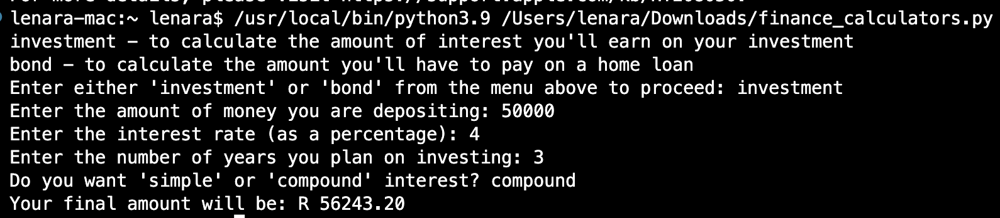
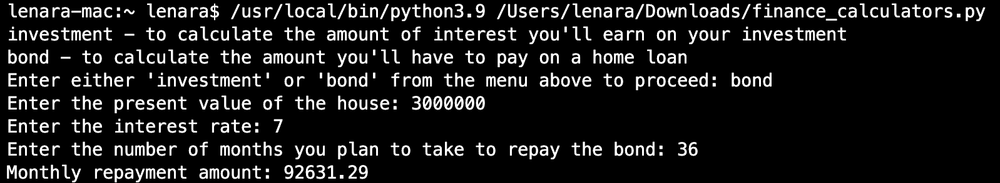

## Project name: Financial Calculators

This project provides a script called `financial_calculators.py` that allows users to perform two types of financial calculations: investment and bond calculations. The script prompts the user to select the type of calculation and then performs the calculation based on the user's input.

## Importance of the Project

Financial calculations play a crucial role in various aspects of personal finance and investment decisions. This project aims to provide a simple and convenient tool for users to calculate the amount of interest they can earn on their investment or the amount they need to pay on a home loan. It allows users to make informed financial decisions and gain a better understanding of the potential outcomes.

## Table of Contents

- [Installation](#installation)
- [Usage](#usage)
- [Screenshots](#screenshots)
- [Credits](#credits)

## Installation

To install this `financial_calculators.py` project locally, follow these steps:

1. Clone the repository to your local machine.
2. Make sure you have Python installed on your system.
3. Open a terminal or command prompt and navigate to the project directory.
4. Run the script using the command `python financial_calculators.py`.

## Usage

Once you have installed the project, you can use the `financial_calculators.py` script as follows:

1. Run the script using the command `python financial_calculators.py`.
2. Select the type of calculation you want to perform (investment or bond).
3. Provide the required input values based on the selected calculation type.
4. The script will perform the calculation and display the result.

## Screenshots

Below are some screenshots of the `financial_calculators.py` script in action:

*Screenshot of the script calculating investment interest.*

*Screenshot of the script calculating bond repayment amount.*

## Credits

This script was developed by [Lenara Sitshayeva](https://github.com/sitshayeva).
