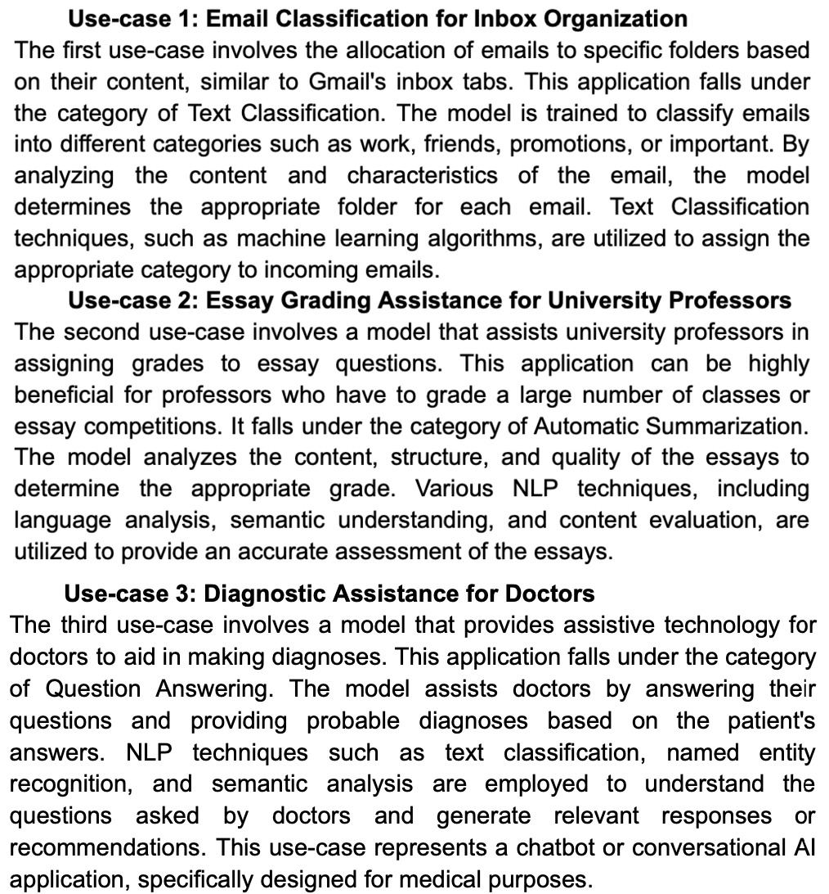
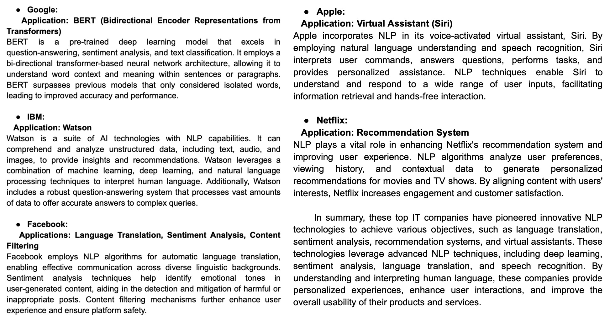

# Project: NLP Applications and Innovative Technologies

This repository provides information about Natural Language Processing (NLP) applications in different use cases and highlights innovative technologies developed by leading companies in the field. It explores the categorization of NLP applications for specific use cases and provides an overview of groundbreaking technologies by Google, IBM, Facebook, Amazon, Apple, and Netflix. The project aims to showcase the importance of NLP and its wide range of applications in various industries.

## Table of Contents
- [Project Description](#project-description)
- [Use-Case Categorization](#use-case-categorization)
- [Innovative Technologies](#innovative-technologies)
- [Export](#export)
- [Usage](#usage)
- [Screenshots](#screenshots)
- [Credits](#credits)

## Project Description
Natural Language Processing (NLP) is a field of artificial intelligence that focuses on the interaction between computers and human language. This project delves into the categorization of NLP applications and explores their importance in different use cases. It covers applications such as email classification, essay grading assistance, and diagnostic support for doctors. By understanding the potential of NLP, we can harness its capabilities to solve complex language-related tasks efficiently.

## Use-Case Categorization
This section categorizes NLP applications for three specific use cases and highlights the importance and functionality of each application. It includes:

1. Email Classification for Inbox Organization:
   - Description: A model that allocates emails to specific folders based on their content, similar to Gmail's inbox tabs.
   - Category: Text Classification
   - Importance: Streamlines email organization and improves efficiency for users.

2. Essay Grading Assistance for University Professors:
   - Description: A model that helps university professors assign grades to essay questions.
   - Category: Automatic Summarization
   - Importance: Facilitates the grading process for professors handling multiple classes or essay competitions.

3. Diagnostic Assistance for Doctors:
   - Description: A model that provides assistive technology for doctors to aid in making diagnoses.
   - Category: Question Answering
   - Importance: Helps doctors by providing probable diagnoses based on patient answers, improving diagnostic accuracy.

## Innovative Technologies
This section highlights the innovative technologies developed by major companies in the NLP domain. It provides a summary of each technology and its application. The technologies covered include:

- Google: BERT (Bidirectional Encoder Representations from Transformers)
- IBM: Watson
- Facebook: Language Translation, Sentiment Analysis, Content Filtering
- Amazon: Recommendation Systems
- Apple: Virtual Assistant (Siri)
- Netflix: Recommendation System

The overview explains the achievements and functionalities of these technologies and how they employ advanced NLP techniques to enhance user experiences.

## Export
To access the NLP_1.pdf and NLP_2.pdf project files locally, follow these steps:
1. [Download NLP_1.pdf](https://github.com/sitshayeva/finalCapstone/blob/main/Project_2/nlp_1.pdf)
2. [Download NLP_2.pdf](https://github.com/sitshayeva/finalCapstone/blob/main/Project_2/nlp_2.pdf)

## Usage
Once the NLP_1.pdf and NLP_2.pdf files are downloaded, follow these instructions to utilize them effectively.

1. Open the NLP_1.pdf file to explore the categorization of NLP applications in different use cases.
2. Open the NLP_2.pdf file to learn about innovative NLP technologies developed by major companies.

## Screenshots

## Credits
This project was authored by Lenara Sitshayeva. For more

 information about the author, visit [Lenara's GitHub profile](https://github.com/sitshayeva).
